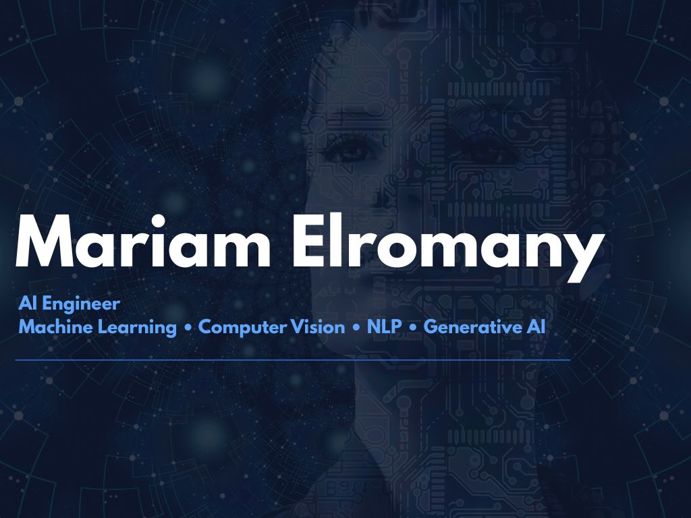

   

 
<h1 align="center">
Hi! I'm Mariam El Romany
</h1>

<h3 align="center">
AI Engineer | Machine Learning | Computer Vision | NLP | Generative AI
</h3>

## About Me

-  B.Sc. Graduate in Artificial Intelligence & Computer Science from **Benha National University**
-  AI Engineer passionate about building intelligent systems using **Machine Learning, Computer Vision, NLP, and Generative AI**
-  Led the development of **SENTRA**, a multi-modal AI interview coaching platform as **Team Leader**
-  Interested in **LLMs, RAG, AI Agents, and applied AI research**
-  Currently seeking opportunities in **AI Engineering, Research, and Graduate Studies**

----

##  Skills

### Programming Languages

### AI & Machine Learning

### Tools & Platforms

### Featured Projects

## SENTRA — Multi-Modal AI Interview Coaching Platform ##

> AI-powered platform that simulates technical interviews using Large Language Models, Computer Vision, and Speech Processing to deliver personalized interview coaching.

## Key Features ##

*  LLaMA 3.3 for intelligent interview question generation
*  ChromaDB vector database for semantic retrieval
*  Knowledge base containing **250,000+ interview questions & answers**
*  Prompt Engineering for adaptive interview difficulty
*  Retrieval-Augmented Generation (RAG)
*  Whisper for speech-to-text transcription
*  YOLOv8 for real-time computer vision analysis
*  Facial emotion and behavior analysis
*  Resume-aware interview customization

## Tech Stack ##

`Python` `FastAPI` `LLaMA 3.3` `ChromaDB` `YOLOv8` `Whisper` `RAG` `Prompt Engineering`

🌐 **Live Demo:** https://sentra-interview-logic.preview.imagine.bo/?_t=1775415038860
**Source Code:** Private — available upon request.

###  LLaMA 3.3 — Adaptive Interview Question Generation

> Intelligent interview question generation system powered by **LLaMA 3.3**, designed to create personalized technical interview questions based on the candidate's performance and context.

###  Highlights

*  Meta LLaMA 3.3
*  ChromaDB Vector Database
*  Prompt Engineering
*  250,000+ Interview Questions & Answers
*  Adaptive Question Difficulty
*  Context-Aware Question Generation
*  FastAPI Backend

###  Tech Stack

`Python` `LLaMA 3.3` `ChromaDB` `Prompt Engineering` `FastAPI`

 **Repository:** https://github.com/mariamelromany/Llama_Project_LLM

###  Transformer-Based Text Summarization

> Comprehensive NLP project exploring both custom and pre-trained Transformer architectures for automatic text summarization, with a comparative performance analysis.

### Highlights

*  Built a Transformer model **from scratch**
*  Fine-tuned a pre-trained **T5 Transformer**
*  Compared custom and pre-trained models
*  Evaluated model performance using summarization metrics
*  Generated concise and coherent summaries from long-form text

###  Tech Stack

`Python` `PyTorch` `Transformers` `T5` `Hugging Face`

 **Repository:** https://github.com/mariamelromany/Model_deep-learning

 ### 👁 Eye Empower

> AI-powered assistive system designed to help visually impaired users understand and interact with their surroundings using Computer Vision.

###  Highlights

*  Real-time object detection
*  Scene understanding
*  Audio feedback for users
*  Real-time processing

###  Tech Stack

`Python` `OpenCV` `YOLOv8` `Deep Learning`

**Repository:** https://github.com/mariamelromany/Eye-Empower_idea

###  PharaVision

> AI-powered restoration system for damaged Ancient Egyptian artifacts using Generative AI and Computer Vision techniques.

###  Highlights

*  Image restoration
*  Generative AI techniques
*  Cultural heritage preservation
*  High-quality image enhancement

###  Tech Stack

`Python` `PyTorch` `GANs` `OpenCV`

**Repository:** https://github.com/mariamelromany/PharaVision

---

###   Experience & Leadership

##  Team Leader — SENTRA Graduation Project

Led an 11-member multidisciplinary team to design and develop **SENTRA**, a multi-modal AI interview coaching platform integrating Computer Vision, Speech Processing, and Large Language Models.

**Responsibilities**

* Led technical planning and task distribution.
* Coordinated AI model integration across multiple modules.
* Managed collaboration between Computer Vision, NLP, and Backend teams.
* Oversaw system integration and final project delivery.

---

##  Machine Learning Bootcamp Instructor

Currently preparing and developing a comprehensive **12-week Machine Learning Bootcamp**, including educational content, practical notebooks, coding exercises, and real-world AI projects.

**Focus Areas**

* Machine Learning Fundamentals
* Supervised & Unsupervised Learning
* Deep Learning Basics
* Hands-on Python Implementation
* Real-world AI Applications

---

#  Currently Learning

*  Large Language Models (LLMs)
*  AI Agents & Multi-Agent Systems
*  Retrieval-Augmented Generation (RAG)
*  MLOps & AI Deployment
*  Advanced Transformer Architectures
  ----

# 📊 GitHub Stats

  
  

  

---

## Connect With Me

---

---

#  Favorite Quote

> *Artificial Intelligence is not about replacing humans it's about empowering them to solve problems beyond imagination.*

## Mariam El Romany ##

---

<h2 align="center">
 Thanks for visiting my profile!
</h2>

Feel free to explore my repositories, connect with me or collaborate on exciting AI projects.

 If you like my work, don't forget to leave a star!

---

 
